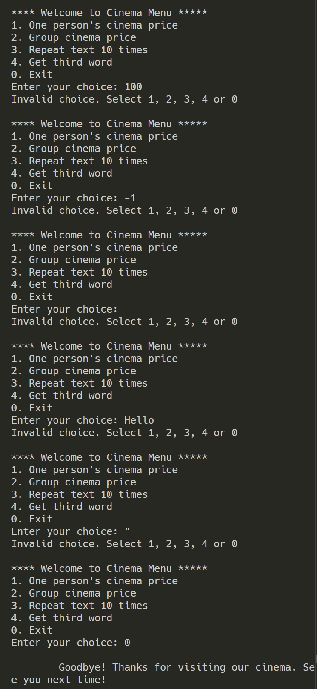
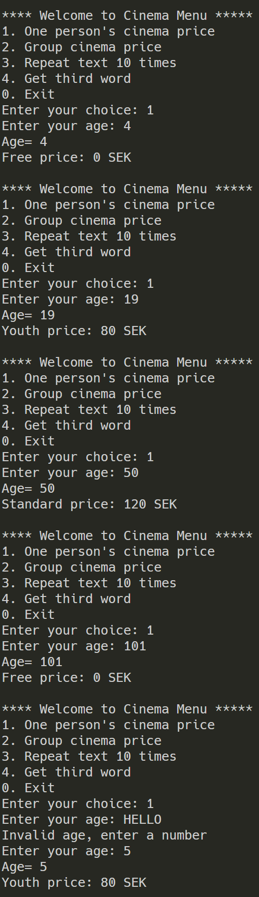
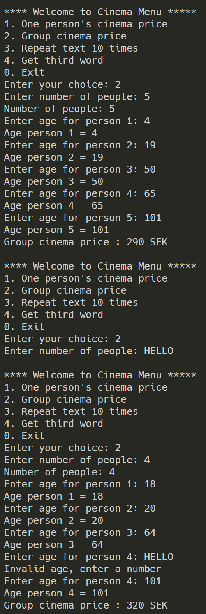
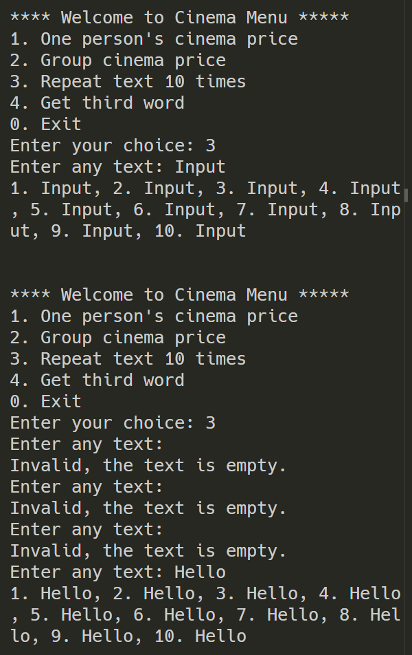
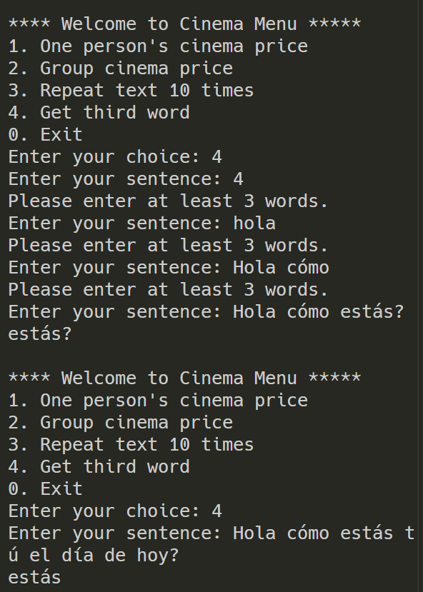

# C# övning - Flöde via loopar och strängmanipulation

OBS - Resultatet av övningen skall visas för lärare och godkännas innan den kan anses vara genomförd.
Övningen kan skrivas helt i programklassen med menyn i Main-metoden.

## Huvudmeny

Skapa en huvudmeny för programmet som håller det vid liv och informerar användaren.
För att skapa programmets huvudmeny ska ni göra följande:

1. Berätta för användaren att de har kommit till huvudmenyn och de kommer navigera genom att skriva in siffror för att testa olika funktioner.
2. Skapa skalet till en Switch-sats som till en början har Två Cases. Ett för ”0” som stänger ner programmet och ett default som berättar att det är felaktig input.
3. Skapa en oändlig iteration, alltså något som inte tar slut innan vi säger till att den ska ta slut. Detta löser ni med att skapa en egen bool med tillhörande while-loop.
4. Bygg ut menyn med val att exekvera de övriga övningarna.

## Menyval 1: Ungdom eller pensionär

För att exemplifiera if-satser skall ni implementera, på uppdrag av en teoretisk lokal bio, ett program som kollar om en person är pensionär eller ungdom vid angiven ålder.
För att komma till denna funktion skall ett case i huvudmenyn skapas för ”1”, detta skall även framgå i texten som förklarar menyn.
För att göra detta skall ni använda er av en nästlad if-sats. Det skall ske enligt följande förlopp:

1. Användaren anger en ålder i siffror
2. Programmet konverterar detta från en sträng till en int
3. Programmet ser om personen är ungdom (under 20 år)
4. Om det ovanstående är sant skall programmet skriva ut: Ungdomspris: 80kr
5. Annars kollar programmet om personen är en pensionär (över 64 år)
6. Om ovanstående är sant skall programmet skruva ut: Pensionärspris: 90kr
7. Annars skall programmet skriva ut: Standardpris: 120kr
   Vi vill även få möjlighet att kunna räkna ut priset för ett helt sällskap.
   Lägg till det alternativet i huvudmenyn (ett case “2”). Det är även ok att ha alternativet i en undermeny.
   Vi anger då först hur många vi är som ska gå på bio. Frågar sedan efter ålder på var och en och skriver sedan ut en sammanfattning i konsolen som ska innehålla följande:
   ● Antal personer
   ● Samt totalkostnad för hela sällskapet

## Menyval 2: Upprepa tio gånger

För att använda en annan typ av iteration skall ni här implementera en for-loop.
Detta ska ni skapa för att upprepa något en användare skriver in tio gånger. Det ska alltså inte skrivas via tio stycken ”Console.Write(Input);” utan via en loop som gör detta tio gånger.
För att komma till den här funktionen skall ni lägga till ett case för ”3” i er huvudmeny samt text som förklarar detta.

### Händelseförloppet visas nedan:

1. Användaren anger en godtycklig text
2. Programmet sparar texten som en variabel
3. Programmet skriver, via en for-loop ut denna text tio gånger på rad, alltså UTAN radbrott.
4. Exempel på output: 1. Input, 2. Input, 3. Input osv.

## Menyval 3: Det tredje ordet

Ni har tidigare lärt er hur vi omvandlar strängar till integers (tex int.Parse, int.TryParse) men nu ska vi dela upp en sträng.
Användaren skall ange en mening, som programmet delar uppi ord via strängens .Split(char)-metod.
Ni skall dela strängen på varje mellanslag.
För att enkelt lagra detta bör input sparas som en var, då ni kommer få tillbaka mer än en sträng.
För att testa det här skall ni skapa case ”4” i er huvudmeny samt skriva en förklaring i texten.

### Händelseförloppet förklaras nedan:

1. Användaren anger en mening med minst 3 ord
2. Programmet delar upp strängen med split-metoden på varje mellanslag
3. Programmet plockar ut den tredje strängen (ordet) ur input
4. Programmet skriver ut den tredje strängen(ordet)

## Dokumentera

Glöm inte att kommentera er kod noga så att ni eller andra enkelt kan förstå den i framtiden.

## Extra uppgifter för de som har tid över:

1. Validera alla inputs från användaren. Se till att programmet inte kraschar vid felaktig input.
2. Barn under fem och pensionärer över 100 går gratis.
3. Hantera flera mellanslag i rad i del 3. 8. Vad du tycker verkar vara intressant att få med eller vill träna på!
   Lycka till!

# C# Exercise 2 - Flow Using Loops and String Manipulation (Engelska)

NOTE - The result of the exercise must be shown to the teacher and approved before it can be considered completed.

The exercise can be written entirely in the Program class with the menu in the Main method.

## Main Menu

Create a main menu for the program that keeps it running and informs the user.

### To create the program's main menu, do the following:

1. Tell the user that they have reached the main menu and that they will navigate by entering numbers to test different functions
2. Create the skeleton of a switch statement that initially has two cases. One for "0", which shuts down the program, and one default case that tells the user that the input is invalid.
3. Create an infinite iteration, meaning something that does not end until we tell it to end. You solve this by creating your own bool together with a while loop.
4. Expand the menu with options to execute the other exercises.

## Menu Option 1: Youth or Pensioner

To demonstrate if statements, you will implement, on behalf of a theoretical local cinema, a program that checks whether a person is a pensioner or a youth based on the specified age.

To access this function, a case must be created in the main menu for "1". This must also be stated in the text that explains the menu.

### To do this, you must use a nested if statement. The process should be as follows:

1. The user enters an age in numbers.
2. The program converts this from a string to an int.
3. The program checks whether the person is a youth (under 20 years old).
4. If the above is true, the program should print: Youth price: 80 SEK
5. Otherwise, the program checks whether the person is a pensioner (over 64 years old).
6. If the above is true, the program should print: Pensioner price: 90 SEK
7. Otherwise, the program should print: Standard price: 120 SEK

## Menu Option 2: Group price

We also want to have the possibility to calculate the price for an entire group. Add this option to the main menu (a case "2"). It is also acceptable to have the option in a submenu.

First, we enter how many people are going to the cinema. Then we ask for the age of each person and finally print a summary in the console containing the following:

• Number of people
• Total cost for the entire group

## Menu Option 3: Repeat Ten Times

To use another type of iteration, you will implement a for loop here. You will create it to repeat something entered by a user ten times.

It should therefore not be written using ten separate "Console.Write(Input);" statements, but instead by using a loop that does this ten times.

To access this function, add a case for "3" to your main menu as well as text explaining this option.

### The process is shown below:

1. The user enters any text.
2. The program saves the text as a variable.
3. The program uses a for loop to output this text ten times on the same line, meaning WITHOUT line breaks.
4. Example output: 1. Input, 2. Input, 3. Input, etc.

## Menu Option 4: The Third Word

You have previously learned how to convert strings to integers (e.g. int.Parse, int.TryParse), but now you will split a string.

The user must enter a sentence, which the program divides into words using the string's .Split(char) method.

You must split the string at every space.

To easily store this, the input should be saved as a var, since you will get back more than one string.

To test this, create case "4" in your main menu and write an explanation in the text.

### The process is explained below:

1. The user enters a sentence with at least 3 words.
2. The program splits the string using the Split method at every space.
3. The program retrieves the third string (word) from the input.
   The program prints the third string (word).

# Document

Do not forget to comment your code carefully so that you or others can easily understand it in the future.

# Extra Tasks for Those Who Have Time Left:

1. Validate all inputs from the user. Make sure that the program does not crash when invalid input is entered.
2. Children under five and pensioners over 100 get in for free.
   Handle multiple consecutive spaces in part 3. --> part 4 (string.Split() method)
3. Add anything that you think would be interesting to include or that you would like to practice.

Good luck!

# Screen shots

## Menu 0

;

## Menu 1

;

## Menu 2

;

## Menu 3

;

## Menu 4

;
